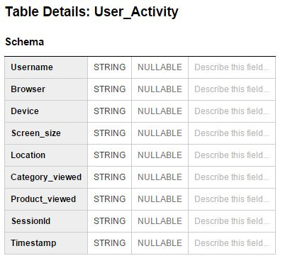
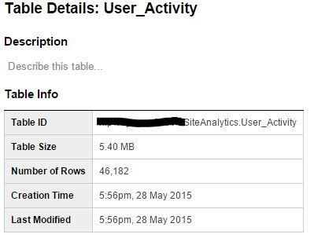

= Code for given Problem

I have coded three applications to execute the problem statement you have given

* Java batch application to generate mock User tracking data.
* Java batch application to load the generated mock data to Google cloud Bigquery dataset. 
* Web application to view statistical data from Bigquery dataset created in above step. 

== Application to generate mock data (CSV):

* This application generates a CSV file with random User tracking data. For current testing, I have created file with 46,182 records.
* The generated file is present in CSV/Mock-load-data.csv

== Application to load mock data (LoadBigquery):

* Using the service account credentials obtained from the cloud console, the application creates a dataset and table using the schema provided. Below is the schema used for table creation,
 +
 +

* Modify below fields appropriately in order to run,

----
csvFile 
ACCOUNT_ID
KEY_FILE
PROJECT_ID
DATASET_ID
TABLE_ID
----

== Application to viewing statistical data (bqapp):

* The web application executes the below queries in BigQuery through a java class using the service account credentials, and displays the data using morris.js charts.

Query shows users who login frequently:
[source,sql]
----
select Username, count(SessionId) as Login_count from (select Username, SessionId, count(SessionId) as scount from [SiteAnalytics.User_Activity] group by Username, SessionId order by scount DESC) group by Username order by Login_count DESC;
----
Query shows users who login frequently:
[source,sql]
----
select Username, count(SessionId) as Login_count from (select Username, SessionId, count(SessionId) as scount from [SiteAnalytics.User_Activity] group by Username, SessionId order by scount DESC) group by Username order by Login_count DESC;
----
Query for most viewed products:
[source,sql]
----
select Product_viewed, count(Product_viewed) as View_count from [SiteAnalytics.User_Activity] group by Product_viewed order by View_count DESC;
----
Query for most viewed categories:
[source,sql]
----
select Category_viewed, count(Category_viewed) as View_count from [SiteAnalytics.User_Activity] group by Category_viewed order by View_count DESC;
----
Most used device:
[source,sql]
----
select Device, count(Device) as count from [SiteAnalytics.User_Activity] group by Device order by count DESC;
----
Most used screen size::
[source,sql]
----
select Screen_size, count(Screen_size) as count from [SiteAnalytics.User_Activity] group by Screen_size order by count DESC;
----
Most used locations:
[source,sql]
----
select Location, count(Location) as count from [SiteAnalytics.User_Activity] group by Location order by count DESC;
----

=== Web screen
image:screenshots/webapp.JPG[] +

[abstract]
Please use Maven for build.